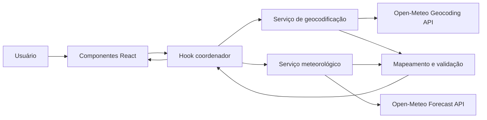
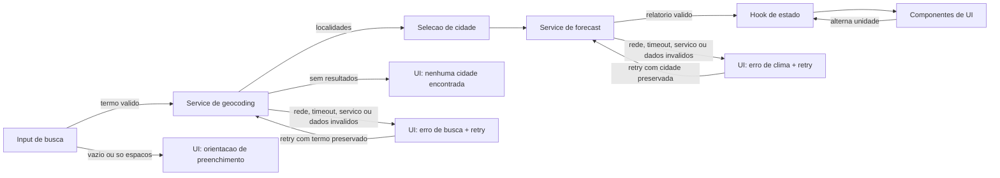

# Plano Técnico — Weather App

## Architecture

A aplicação será uma SPA client-side organizada em quatro responsabilidades, sem
backend próprio:



- **Apresentação:** componentes React sem conhecimento do formato bruto das APIs.
  Exibem busca, resultados, clima atual, cinco dias, unidade e estados
  operacionais. Elementos HTML semânticos, regiões vivas e foco visível atendem
  RF1–RF9 e RNF1–RNF3.
- **Coordenação:** um hook de aplicação mantém estado, dispara operações, oferece
  retry e impede respostas obsoletas. Um `AbortController` independente para
  busca e outro para clima limitam cada categoria a uma operação ativa; o timeout
  começa no disparo da requisição e qualquer resposta subsequente de uma
  operação substituída é descartada silenciosamente (RF7, RF8 e RF10).
- **Serviços:** funções assíncronas isolam URL, parâmetros, timeout e transporte.
  Não armazenam estado e retornam modelos internos ou erros tipados (RNF5 e
  RNF11).
- **Domínio:** funções puras validam e transformam respostas, mapeiam códigos WMO,
  convertem temperaturas e formatam datas/horários em pt-BR (RF3, RF4, RF6 e
  RF11). Esta camada pode viver em arquivos dedicados ou em utilitários locais,
  sem exigência de uma estrutura extra se a lógica for pequena e clara.

Não serão adicionados roteamento, cache de servidor, gerenciamento global de
estado ou camada de repositório. Há uma única tela e uma única cidade ativa.

## Tech Stack

| Tecnologia | Uso e decisão |
| --- | --- |
| TypeScript strict | Contratos explícitos para respostas externas, modelos internos, estados e erros. Dados externos entram como `unknown` e são validados antes do uso. |
| React 19 | Componentes, estado local e hook coordenador; suficiente para a única tela e evita uma dependência de estado global. |
| Vite 8 | Desenvolvimento e build da SPA já configurados no projeto. |
| Tailwind CSS 3 | Layout mobile-first, tema dark glassmorphism e estados de foco/contraste consistentes. |
| `fetch` + `AbortController` | Cliente HTTP nativo para HTTPS, cancelamento, timeout e descarte de operações antigas, sem biblioteca adicional. |
| `Intl.DateTimeFormat` | Datas e horários em `pt-BR` com o fuso informado pela cidade/API. |
| Vitest + Testing Library | Testes unitários de domínio, serviços, hook e comportamento acessível dos componentes. |
| Playwright | Fluxos E2E, teclado, responsividade e integração simulada com as APIs. |
| Biome | Lint e formatação conforme a configuração do repositório. |

## Project Structure

```text
src/
├── components/
│   ├── CitySearch.tsx          # entrada, validação e início da busca
│   ├── SearchResults.tsx       # lista acessível e seleção inequívoca
│   ├── CurrentWeather.tsx      # clima e horário local atuais
│   ├── DailyForecast.tsx       # lista dos cinco dias
│   ├── TemperatureToggle.tsx   # alternância C/F
│   └── OperationStatus.tsx     # loading, vazio, erro e retry
├── hooks/
│   └── useWeatherApp.ts        # estado e coordenação do fluxo principal
├── services/
│   ├── geocodingService.ts     # chamada e adaptação de localidades
│   └── weatherService.ts       # chamada e adaptação do clima/previsão
├── domain/                     # opcional; utilitários de domínio se a lógica crescer
│   ├── temperature.ts          # conversão e arredondamento
│   ├── weatherCodes.ts         # vocabulário WMO em pt-BR
│   └── dateTime.ts             # apresentação no fuso da cidade
├── types/
│   ├── weather.ts              # modelos internos
│   ├── api.ts                  # DTOs externos mínimos
│   └── errors.ts               # erros recuperáveis e de validação
├── App.tsx                     # composição da única tela
├── main.tsx
└── index.css
tests/
├── unit/                       # domínio, serviços, hook e componentes
├── e2e/                        # fluxos principais e viewports
└── fixtures/                   # respostas determinísticas das APIs
```

Os nomes indicam responsabilidades, não exigem que cada arquivo seja criado de
imediato. A decomposição em tarefas deve preservar um componente React por
arquivo e manter transporte, transformação e apresentação independentes.
Se a lógica virar pequena e estável, é aceitável manter funções de domínio em
arquivos utilitários sem criar uma estrutura extra para o MVP (RNF11).

## Data Model

Contratos internos propostos; são decisões de interface, não implementação:

```ts
type TemperatureUnit = "celsius" | "fahrenheit";

interface City {
  id: number;
  name: string;
  country: string;
  region?: string;
  latitude: number;
  longitude: number;
  timezone: string;
}

type WeatherCondition =
  | "Céu limpo"
  | "Parcialmente nublado"
  | "Nublado"
  | "Neblina"
  | "Garoa"
  | "Chuva"
  | "Neve"
  | "Pancadas"
  | "Tempestade"
  | "Condição indisponível";

interface CurrentWeather {
  observedAt: string; // data/hora ISO local devolvida pela API
  temperatureCelsius: number;
  condition: WeatherCondition;
}

interface ForecastDay {
  date: string; // YYYY-MM-DD no fuso da cidade
  minimumCelsius: number;
  maximumCelsius: number;
  condition: WeatherCondition;
}

interface WeatherReport {
  city: City;
  current: CurrentWeather;
  forecast: readonly ForecastDay[]; // validado para exatamente cinco itens
}

type OperationStatus = "idle" | "loading" | "success" | "empty" | "error";
type OperationKind = "search" | "weather";
type AppErrorCode = "network" | "timeout" | "service" | "invalid-data";

interface AppError {
  operation: OperationKind;
  code: AppErrorCode;
  message: string; // mensagem específica em pt-BR
  recoverable: true;
}

interface OperationState<T> {
  status: OperationStatus;
  data: T;
  error: AppError | null;
}

interface WeatherAppState {
  query: string;
  lastSubmittedQuery: string | null;
  search: OperationState<readonly City[]>;
  selectedCity: City | null;
  weather: OperationState<WeatherReport | null>;
  unit: TemperatureUnit;
}
```

As temperaturas canônicas permanecem em Celsius no modelo. Fahrenheit é
derivado somente para apresentação por $F = (C \times 9/5) + 32$. O
arredondamento inteiro deve ser uma função pura que, em empates de meio grau,
arredonda para longe de zero; `Math.round` isoladamente não atende valores
negativos. Assim, alternar a unidade não acumula erro nem refaz requisições
(RF5–RF6).

`region` é opcional e sua ausência não invalida uma cidade. Código WMO ausente
ou desconhecido gera `"Condição indisponível"`. Em contraste, cidade sem nome,
país ou coordenadas válidas, ou clima sem associação segura entre data,
temperatura e condição, produz `invalid-data` recuperável (RF11).

## Data Flow



### Busca e seleção

1. O usuário altera `query`; Enter ou o botão de busca envia `query.trim()`.
2. Termo vazio é rejeitado localmente com orientação textual, sem `fetch` (RF1).
3. O hook cancela a busca anterior, cria um identificador/controle novo, grava
   `lastSubmittedQuery` e muda `search` para `loading` imediatamente.
4. O timeout da busca começa no momento do disparo da requisição; se exceder 10
   segundos, a operação é encerrada como falha recuperável e a UI passa para o
   estado de erro correspondente.
5. O serviço consulta geocodificação e valida os itens. Mantém a ordem da API e
   retorna no máximo os dez primeiros resultados válidos.
6. Somente a operação ainda atual pode publicar `success`, `empty` ou `error`.
7. Ao selecionar uma opção, o objeto `City` completo é preservado. Resultados
   meteorológicos anteriores deixam de representar o estado atual, e a consulta
   por latitude/longitude começa (RF2 e RF10).

### Clima e previsão

1. O hook cancela a consulta meteorológica anterior, define `weather.loading` e
   chama o serviço com a cidade selecionada.
2. O timeout da consulta meteorológica também começa no disparo da requisição e
   não há retry automático; uma falha recuperável apenas expõe a ação de retry
   após o erro.
3. O serviço solicita clima atual e previsão diária juntos, com `timezone=auto`
   e cinco dias, e transforma a resposta em um único `WeatherReport`.
4. A transformação valida cidade selecionada, timezone, clima atual e arrays
   diários alinhados. A previsão deve conter exatamente hoje local + quatro dias
   consecutivos; caso contrário, retorna erro recuperável (RF3, RF4 e RF11).
5. A UI apresenta o horário com `Intl.DateTimeFormat("pt-BR", { timeZone })` e
   deriva todas as temperaturas da unidade ativa.

### Unidade e retry

- A unidade inicia em `celsius` a cada carregamento e permanece apenas no estado
  React. Alterná-la recalcula a apresentação de todo o relatório, sem mutar o
  modelo, alterar datas/cidade ou acessar a rede (RF5 e RF6).
- Retry de busca usa `lastSubmittedQuery`; retry de clima usa `selectedCity`.
  A unidade atual permanece intacta. Não existe retry automático; o retry só
  aparece após falha recuperável e preserva a operação relevante (RF8).

## External APIs

Todas as chamadas usam `GET` por HTTPS e timeout local de 10 segundos.

### Geocoding API

- Endpoint: `https://geocoding-api.open-meteo.com/v1/search`
- Parâmetros: `name=<termo com trim>`, `count=10`, `language=pt`,
  `format=json`.
- Campos consumidos por resultado: `id`, `name`, `country`, `admin1`,
  `latitude`, `longitude`, `timezone`.
- `admin1` mapeia para `region`. Resultados ausentes significam estado vazio;
  HTTP não exitoso, falha de rede ou payload inválido significam erro.

Contrato externo mínimo:

```ts
interface GeocodingApiResponse {
  results?: Array<{
    id?: number;
    name?: string;
    country?: string;
    admin1?: string;
    latitude?: number;
    longitude?: number;
    timezone?: string;
  }>;
}
```

### Forecast API

- Endpoint: `https://api.open-meteo.com/v1/forecast`
- Coordenadas: `latitude`, `longitude` da opção selecionada.
- Parâmetros atuais: `current=temperature_2m,weather_code`.
- Parâmetros diários:
  `daily=weather_code,temperature_2m_max,temperature_2m_min`.
- Contexto: `timezone=auto`, `forecast_days=5`,
  `temperature_unit=celsius`.
- Campos consumidos: `timezone`, `current.time`,
  `current.temperature_2m`, `current.weather_code`, `daily.time`,
  `daily.temperature_2m_min`, `daily.temperature_2m_max` e
  `daily.weather_code`.

Contrato externo mínimo:

```ts
interface ForecastApiResponse {
  timezone?: string;
  current?: {
    time?: string;
    temperature_2m?: number;
    weather_code?: number;
  };
  daily?: {
    time?: string[];
    temperature_2m_min?: number[];
    temperature_2m_max?: number[];
    weather_code?: number[];
  };
}
```

Os DTOs são permissivos porque representam entrada não confiável; o serviço
converte para os modelos internos estritos. Não há chave, proxy, cookies nem
persistência de termos (RNF7).

## State Management

Um hook `useWeatherApp` usa primitivas do React (`useState` ou `useReducer`) e é
a única fonte de verdade da tela. `useReducer` é preferível se a implementação
precisar garantir transições atômicas entre status, dados e erros; não se adota
uma biblioteca externa.

- `query` acompanha o campo e `lastSubmittedQuery` preserva o retry exato.
- `selectedCity` preserva identidade e coordenadas da seleção.
- `search` e `weather` têm estados independentes para mensagens específicas.
- `unit` vive no topo da tela, inicia em Celsius e não usa `localStorage` nem
  `sessionStorage`.
- Controles de aborto e IDs incrementais vivem em refs, fora do estado visual.
  Cancelar reduz trabalho; comparar o ID antes de publicar é a garantia final
  contra respostas obsoletas que não respeitem aborto (RF10).
- Na desmontagem, operações pendentes são canceladas para evitar atualizações
  após o ciclo de vida da tela.

## Error Handling

- O helper HTTP inicia um temporizador de 10 segundos junto com a requisição e
  combina timeout, cancelamento por supersessão e desmontagem via
  `AbortController`. Apenas timeout vira erro visível; cancelamento por uma
  operação mais nova é silencioso. O relógio começa no disparo da requisição, não
  quando a resposta chega.
- Falha de conexão vira `network`; timeout vira `timeout`; HTTP não exitoso vira
  `service`; payload essencial inválido vira `invalid-data`. Todos são
  recuperáveis nesta versão e oferecem retry contextual, preservando a busca ou
  cidade em execução.
- Mensagens são textuais, específicas e em pt-BR: busca, clima atual, previsão,
  vazio, erro e retry devem ser explicitamente distintos. Regiões com
  `role="status"` anunciam loading/vazio; erros usam `role="alert"`. O foco não
  é movido durante loading, mas, após erro, o botão de retry permanece
  alcançável e nomeado.
- Busca vazia é validação local, não erro de serviço. Busca sem resultados é
  `empty`, não `error`, e nunca dispara clima.
- Ao iniciar nova busca ou seleção, dados antigos não são atribuídos à nova
  operação. A UI pode manter estrutura estável, mas não deve rotular clima antigo
  como pertencente ao termo/cidade em carregamento (RF7 e RF10).
- Campo opcional isolado usa “Indisponível”. Condição desconhecida usa
  “Condição indisponível”. Dados essenciais inválidos impedem a publicação de um
  relatório parcial (RF11).

## Testing Strategy

### Unitários e integração de componentes — Vitest

- **Domínio:** tabela completa WMO e fallback; Celsius/Fahrenheit; positivos e
  negativos em meio grau; datas e “Atualizado às HH:mm” em fusos distintos.
- **Serviços:** trim e parâmetros; limite/ordem de dez cidades; adaptação de
  `admin1`; cinco arrays diários alinhados; payloads incompletos; HTTP, rede e
  timeout; abort silencioso de operação substituída.
- **Hook:** Celsius inicial e manutenção na sessão; transições de loading,
  success, empty e error; retry com termo/cidade preservados; unidade sem nova
  chamada; resposta antiga ignorada em busca e clima.
- **Componentes:** envio por Enter, nenhuma chamada para espaços, conteúdo de
  cidades homônimas, exatamente cinco dias, unidade explícita, mensagens
  anunciadas, nomes acessíveis e fluxo de foco/seleção por teclado.

Timers falsos validam timeout de 10 segundos e feedback síncrono dentro de 100
ms. `fetch` é substituído na fronteira dos serviços; fixtures representam
sucesso, vazio, atraso, erro, código WMO desconhecido e dados parciais.

### E2E — Playwright

As rotas da Open-Meteo serão interceptadas para testes determinísticos:

1. Buscar, distinguir cidades homônimas, selecionar e conferir clima + cinco
   datas locais (RF1–RF4).
2. Alternar C/F, conferir valores e unidade em clima e previsão, e realizar nova
   busca preservando a unidade (RF5–RF6).
3. Validar loading, vazio, falha, timeout e retry com contexto preservado
   (RF7–RF8 e RF11).
4. Completar o fluxo somente por teclado, com nomes e foco visível (RF9/RNF3).
5. Responder requisições fora de ordem e confirmar que somente a mais recente é
   exibida (RF10).
6. Executar em 320 × 568, 667 × 375 e 1280 × 720 sem rolagem horizontal,
   sobreposição ou corte de controles (RNF1).

Contraste e semântica devem integrar a verificação de acessibilidade. A matriz
com versões atual e anterior de Chrome, Firefox e Safari pertence ao pipeline de
entrega; localmente, Playwright cobre os engines disponíveis e registra a
limitação quando Safari real não estiver disponível (RNF6).

Cada teste deve citar RF/AC e RNF aplicáveis no nome ou descrição para manter a
rastreabilidade da spec até a validação (RNF10).

## Risks & Trade-offs

| Decisão/risco | Trade-off | Mitigação |
| --- | --- | --- |
| Dependência direta da Open-Meteo no navegador | Simplicidade e ausência de backend, mas sujeita a disponibilidade, CORS e mudanças de contrato. | DTO mínimo, validação na fronteira, timeout e retry; nenhuma inferência de dados. |
| Uma chamada agrega clima atual e diário | Mantém cidade e instante consistentes e reduz coordenação; uma falha afeta ambos. | Tratar o relatório como unidade, conforme campos essenciais da spec, e repetir a mesma chamada. |
| Celsius como valor canônico | Conversão local é rápida e estável; pode diferir de eventual arredondamento da API em Fahrenheit. | Usar fórmula e regra de arredondamento da spec, com testes de fronteira. |
| `timezone=auto` | Evita banco local de fusos, mas exige confiar e validar o timezone retornado. | Preservar timezone da cidade e rejeitar resposta sem associação segura. |
| Cancelamento mais ID de requisição | Pequena duplicação de mecanismo, porém cobre APIs/ambientes onde aborto não impede resolução. | Encapsular a coordenação no hook e testar respostas fora de ordem. |
| Estado local sem cache/persistência | Nova carga perde unidade, cidade e dados, exatamente como requerido; buscas repetidas acessam a rede. | Aceitar no MVP; cache e persistência permanecem fora do escopo. |
| Validação manual de DTOs mínimos | Evita adicionar biblioteca para dois payloads pequenos, mas requer atenção a arrays e tipos. | Funções puras, testes com payload parcial e validação estrita na fronteira. |
| Formatação temporal | Strings locais sem offset podem ser interpretadas no fuso do dispositivo se convertidas diretamente. | Tratar datas diárias como datas civis e sempre formatar horário com timezone explícito, sem `new Date` ingênuo. |
| Dark glassmorphism | Transparência pode prejudicar contraste e legibilidade. | Superfícies com contraste WCAG AA, fallback visual e testes nos viewports definidos. |
| Compatibilidade entre navegadores | Safari real não é coberto pelo engine WebKit em todos os detalhes. | Pipeline/matriz de lançamento nas versões exigidas e uso de APIs web amplamente suportadas. |

O plano deliberadamente exclui autenticação, geolocalização, favoritos, histórico,
modo offline, previsão horária, dados adicionais e múltiplas cidades, preservando
o escopo e evitando abstrações antecipadas.